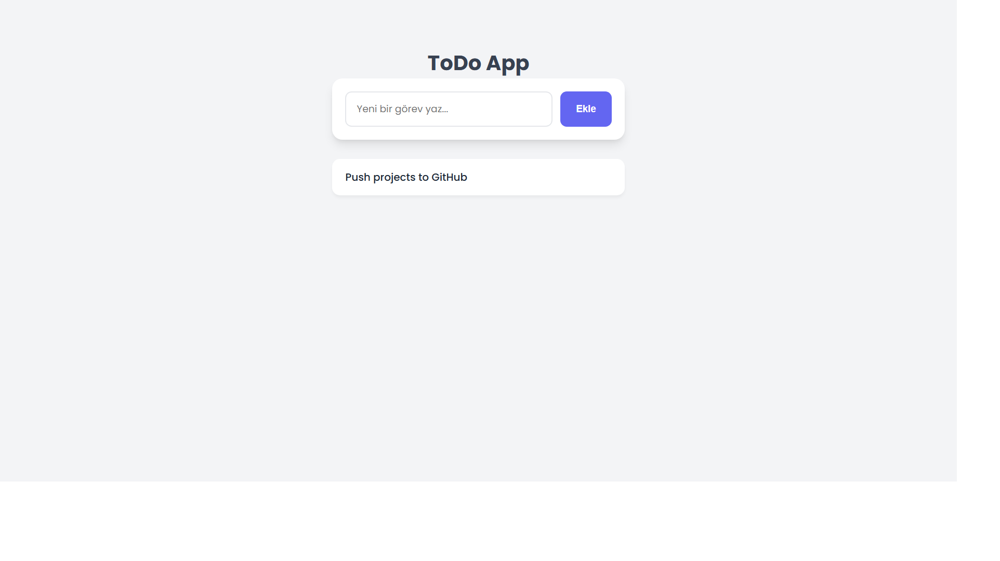

# 📝 Modern ToDo App

---

## 🇹🇷 Türkçe 

Bu proje, HTML, CSS ve JavaScript kullanılarak geliştirilmiş modern ve kullanıcı dostu bir görev takip uygulamasıdır. Tarayıcının yerel hafızasını (Local Storage) kullanarak verilerinizi kaydeder, böylece sayfayı yenileseniz bile görevleriniz silinmez.

### 🚀 Özellikler
* Yeni görev ekleme
* Görev silme (üzerine tıklayarak)
* Verilerin Local Storage ile tarayıcıda tutulması
* Modern, şık ve ferah UI tasarımı

### 🛠️ Kullanılan Teknolojiler
* HTML5
* CSS3
* JavaScript (Vanilla JS)

---

## 🇬🇧 English 

This project is a modern and user-friendly task tracking application developed using HTML, CSS, and JavaScript. It saves your data using the browser's Local Storage, so your tasks won't be deleted even if you refresh the page.

### 🚀 Features
* Add new tasks
* Delete tasks (by clicking on them)
* Data persistence using Local Storage
* Modern, clean, and spacious UI design

### 🛠️ Technologies Used
* HTML5
* CSS3
* JavaScript (Vanilla JS)
